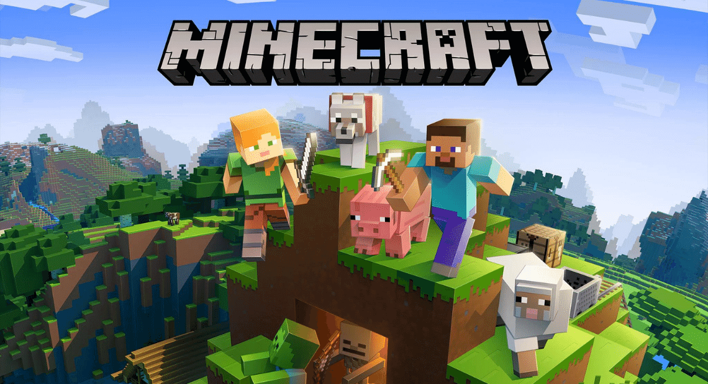

# Minecraft Scripting TypeScript Starter

This template starter repo contains a simple build process and TypeScript compilation for Minecraft Bedrock Edition.



> This was taken from the original repo available here [https://github.com/microsoft/minecraft-scripting-samples](https://github.com/microsoft/minecraft-scripting-samples) - they also include a nice tutorial - you can follow along here [https://github.com/microsoft/minecraft-scripting-samples/tree/main/ts-starter](https://github.com/microsoft/minecraft-scripting-samples/tree/main/ts-starter)

This starter is a great way to get started developing your addons for Minecraft, Scripting using TypeScript.

## Prerequisites

**As at the moment of writing, the tools will only work for windows machines with Minecraft Bedrock Edition installed.**

Still, with some adaptations to the gulpfile.js, you can use this starter to build out your own projects on other platforms.

**Install Node.js tools, if you haven't already**

We're going to use the package manager [npm](https://www.npmjs.com/package/npm) to get more tools to make the process of building our project easier.

Visit [https://nodejs.org/](https://nodejs.org).

Download the version with "LTS" next to the number and install it. (LTS stands for Long Term Support, if you're curious.) In the Node.js Windows installer, accept the installation defaults. You do not need to install any additional tools for Native compilation.

**Install Visual Studio Code, if you haven't already**

Visit the [Visual Studio Code website](https://code.visualstudio.com) and install Visual Studio Code.

## Getting Started

1. Use npm to install our tools:

   ```powershell
   npm i
   ```

It might also ask you to install the Minecraft Debugger and Blockception's Visual Studio Code plugin, which are plugins to Visual Studio Code that can help with Minecraft development. Go ahead and do that, if you haven't already.

1. Available commands:

   ```powershell
   npm run build # Build the project
   npm run dev # Build the project and watch for changes
   ```

### Chapter 1. Customize the behavior pack

In Visual Studio Code, expand the `behavior_packs` node in the treeview to the left, and rename the **starterbp** folder whatever you'd like to call it, for example "mypack".

Use the Find/Replace command (Ctrl-Shift-F) to search for "starterbp" and replace the instance in **gulpfile.js** and the instance in **launch.json** with "mypack". (Should be the same name as defined on the previous step.)

Go back the Files tree view and open `behavior_packs\mypack\manifest.json`

Update the name and description properties to something like "My pack Behavior Pack" and "My TypeScript Project".

Update the first and second UUID properties to make it unique to your project. See [this article](https://learn.microsoft.com/minecraft/creator/documents/behaviorpack) for tips on working with behavior packs and creating your own unique UUIDs.

> IMPORTANT:
> You may also need to update the version of Beta APIs in your `dependencies` section to match your version of Minecraft.
> Versions 1.19.40 feature `1.0.0-beta` APIs
> Versions 1.19.50 feature `1.1.0-beta` APIs
> Future versions will likely require updated versions of Beta APIs.

### Chapter 2. Let's test the parts of our project

To get started, go into PowerShell and navigate to your the project root directory.
Run this command:

```powershell
Set-ExecutionPolicy -Scope Process -ExecutionPolicy Bypass
```

Run this one, too.

```powershell
npm run build
```

This uses a build tool called GulpJS and automatically compiles your TypeScript project and pushes it over into Minecraft.

You may hear a little tone through your speakers when it has successfully completed deployment.

Launch Minecraft and create a new world:

1. Call it **My pack Test**.
1. Select a Creative game mode.
1. Select a Flat world option, under the Advanced section of the Create New World screen.
1. Under Behavior Packs, under Available, you should see your My Pack Behavior Pack. Select it and Activate it.
1. Enable the Beta APIs experiment toggle, under the Experiments section of the Create New World screen.
1. Create the world and go into it.

Now you're in. Great!

By default, this starter pack comes with a simple script that will display a message:

`[Script Engine] Hello starter!`

This means your behavior pack is working and your tools for compiling and pushing TypeScript are just fine. Awesome!
Go back to your PowerShell window, and enter:

```powershell
npm run dev
```

You should see gulp compile and deploy to the Minecraft folder, and make a noise when it does that. From here, we don't need to tend to PowerShell except to see if there are any compilation errors down the road.

When you are done coding for the day, either hit **ctrl-c** in the PowerShell Window to stop the watch mode or close the window.

Save and Quit to exit out of the world.

We'll want to reload the world from here - any time you make a script change, you need to exit out of the world and reload it to see changes. Or, you can run the `/reload` command to reload the JavaScript files that have been deployed.

### Summary

If you'r like to learn more about minecraft scripting using TypeScript, please refer to the original start, which also contains a nice tutorial, easy to follow along:

[https://github.com/microsoft/minecraft-scripting-samples](https://github.com/microsoft/minecraft-scripting-samples)

## Manifest

- [gulpfile.js](https://github.com/microsoft/minecraft-scripting-samples/blob/main/ts-starter/gulpfile.js): This file contains build instructions for Gulp, for building out TypeScript code.
- [scripts](https://github.com/microsoft/minecraft-scripting-samples/blob/main/ts-starter/scripts): This contains all of your TypeScript files, that will be compiled and built into your projects.
- [behavior_packs](https://github.com/microsoft/minecraft-scripting-samples/blob/main/ts-starter/behavior_packs): This contains resources and JSON files that define your behavior pack.

## License

[MIT - Microsoft - See LICENSE](LICENSE)

## Trademarks

This project is not affiliated with, endorsed, sponsored, or specifically approved by Microsoft Corporation.

This project may contain trademarks or logos for projects, products, or services. Authorized use of Microsoft trademarks or logos is subject to and must follow Microsoft's Trademark & Brand Guidelines. Use of Microsoft trademarks or logos in modified versions of this project must not cause confusion or imply Microsoft sponsorship. Any use of third-party trademarks or logos are subject to those third-party's policies.
